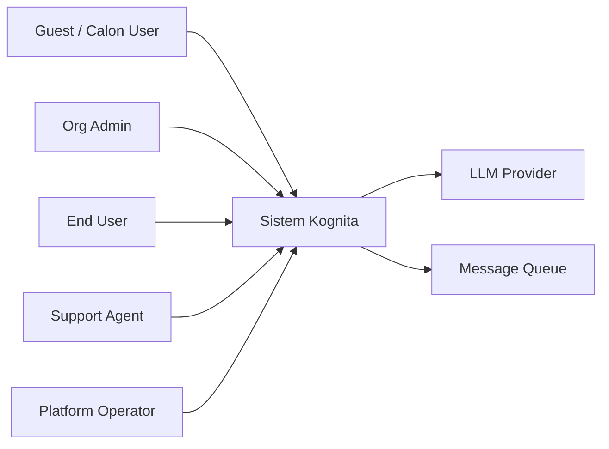

# 02 — Aktor & Use Case

## 1. Aktor

| Aktor | Deskripsi | Fase masuk |
| ----- | --------- | ---------- |
| Guest | Belum login; bisa registrasi tenant/user | 1 |
| Org Admin | Admin organisasi tenant | 1 |
| End User | Pengguna chat & knowledge | 1–2 |
| Support Agent | Menangani tiket/eskalasi | 4 |
| Platform Operator | Operasi platform lintas tenant | 5 |
| Sistem | Worker ingestion, scheduler, agent runtime | 3–4 |
| LLM Provider | Ollama / Gemini / dll | 2+ |

---

## 2. Use Case Diagram (Ringkas)

```mermaid
flowchart TB
    subgraph Auth
        UC1[Registrasi tenant & admin]
        UC2[Login / logout]
        UC3[Refresh token]
    end

    subgraph TenantAdmin
        UC4[Invite / kelola user]
        UC5[Upload dokumen]
        UC6[CRUD dokumen]
        UC7[Konfigurasi system prompt]
        UC8[Lihat analytics]
    end

    subgraph Chat
        UC9[Buat conversation]
        UC10[Kirim pertanyaan streaming]
        UC11[Lihat riwayat chat]
    end

    subgraph Knowledge
        UC12[Ingest dokumen async]
        UC13[Cari knowledge hybrid]
        UC14[Jawab dengan sitasi RAG]
    end

    subgraph Agent
        UC15[Buat tiket via chat]
        UC16[Eskalasi ke manusia]
        UC17[Kelola tiket]
    end

    Admin --> UC1
    Guest --> UC1
    Admin --> UC2
    User --> UC2
    Admin --> UC4
    Admin --> UC5
    Admin --> UC6
    Admin --> UC7
    Admin --> UC8
    User --> UC9
    User --> UC10
    User --> UC11
    System --> UC12
    User --> UC13
    User --> UC14
    User --> UC15
    User --> UC16
    Support --> UC17
```

---

## 3. Katalog Use Case

### UC-01 — Registrasi Tenant & Admin

| Field | Isi |
| ----- | --- |
| Aktor | Guest |
| Prekondisi | Email belum terdaftar |
| Alur utama | Isi nama organisasi + email + password → sistem buat `Tenant` + `User` role ADMIN → return JWT |
| Alternatif | Email sudah ada → 409 Conflict |
| Postkondisi | Tenant aktif, admin bisa login |

### UC-02 — Login

| Field | Isi |
| ----- | --- |
| Aktor | Admin / User / Support |
| Prekondisi | Akun terdaftar & aktif |
| Alur utama | Email + password → verifikasi → JWT (access + refresh) |
| Alternatif | Kredensial salah → 401 |
| Postkondisi | Session berbasis token |

### UC-03 — Kelola User (Admin)

| Field | Isi |
| ----- | --- |
| Aktor | Org Admin |
| Prekondisi | JWT valid, role ADMIN, tenant match |
| Alur utama | Create/list/update/deactivate user dalam tenant sendiri |
| Aturan | Tidak bisa akses user tenant lain |

### UC-04 — Upload Dokumen

| Field | Isi |
| ----- | --- |
| Aktor | Org Admin (dan role yang diizinkan) |
| Prekondisi | Auth + kuota tenant (jika ada) |
| Alur utama | Upload file → simpan MinIO → metadata DB status `UPLOADED` → publish event ingestion |
| Postkondisi | Dokumen ada; ingestion berjalan async (Fase 3+) |

### UC-05 — CRUD Dokumen

| Field | Isi |
| ----- | --- |
| Aktor | Org Admin |
| Alur utama | List/get/update metadata/delete dokumen milik tenant |
| Aturan | Filter wajib `tenant_id` dari JWT, bukan dari request body |

### UC-06 — Chat Streaming

| Field | Isi |
| ----- | --- |
| Aktor | End User / Admin |
| Prekondisi | Auth; (Fase 3+) minimal ada dokumen `READY` opsional |
| Alur utama | Buat/lanjut conversation → kirim message → SSE stream token jawaban → simpan message |
| Alternatif | Rate limit → 429 |

### UC-07 — Jawab dengan RAG

| Field | Isi |
| ----- | --- |
| Aktor | End User |
| Prekondisi | Dokumen sudah ter-index |
| Alur utama | Embed pertanyaan → retrieve top-k chunk → susun prompt → LLM → jawaban + sitasi |
| Alternatif | Tidak ada chunk relevan → jawab jujur / arahkan eskalasi |

### UC-08 — Buat Tiket via Agent

| Field | Isi |
| ----- | --- |
| Aktor | End User (via chat) |
| Prekondisi | Agent tools aktif |
| Alur utama | LLM memutuskan tool `createTicket` → sistem buat `Ticket` → konfirmasi ke user |
| Postkondisi | Tiket tersimpan, status `OPEN` |

### UC-09 — Eskalasi ke Manusia

| Field | Isi |
| ----- | --- |
| Aktor | End User / Agent |
| Alur utama | Tool escalate → buat tiket tipe ESCALATION → assign ke Support (atau queue) |
| Postkondisi | Support melihat tiket di antrean |

### UC-10 — Monitoring & Analytics (Admin)

| Field | Isi |
| ----- | --- |
| Aktor | Org Admin |
| Alur utama | Lihat jumlah dokumen, chat, tiket, token usage (jika diukur) |
| Catatan | Detail metrik infrastruktur untuk Platform Operator (Fase 5) |

---

## 4. Matriks Aktor × Use Case

| Use Case | Guest | Admin | User | Support | System |
| -------- | :---: | :---: | :---: | :---: | :---: |
| Registrasi | ✓ | | | | |
| Login | | ✓ | ✓ | ✓ | |
| Kelola user | | ✓ | | | |
| Upload/CRUD dokumen | | ✓ | | | |
| Konfigurasi prompt | | ✓ | | | |
| Chat | | ✓ | ✓ | | |
| RAG answer | | ✓ | ✓ | | |
| Buat tiket (agent) | | ✓ | ✓ | | |
| Kelola tiket | | ✓ | lihat | ✓ | |
| Ingestion | | | | | ✓ |
| Analytics | | ✓ | | | |

---

## 5. Aturan Bisnis Lintas Use Case

1. **Tenant isolation:** setiap query data scoped ke `tenant_id` dari token.
2. **Least privilege:** USER tidak bisa hapus dokumen milik organisasi (default).
3. **Async ingestion:** upload sukses ≠ dokumen siap ditanya; status harus `READY`.
4. **Sitasi:** jawaban RAG sebaiknya menyertakan referensi dokumen/chunk.
5. **Human-in-the-loop:** agent boleh buat tiket, tapi tidak menutup tiket kritis tanpa manusia (kebijakan default).
