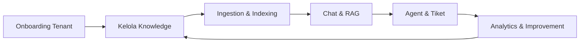
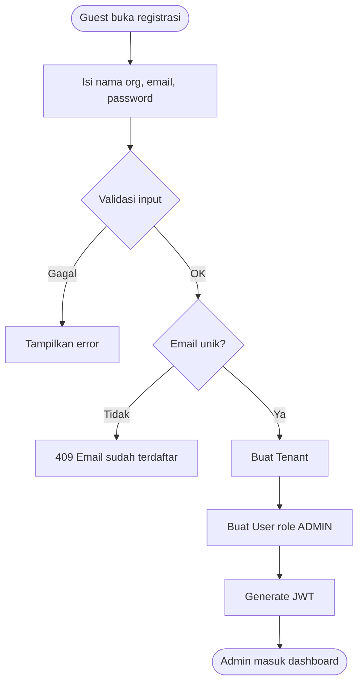
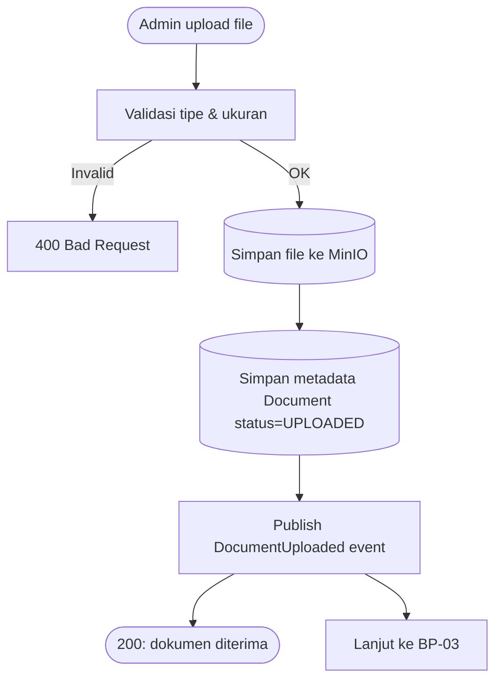
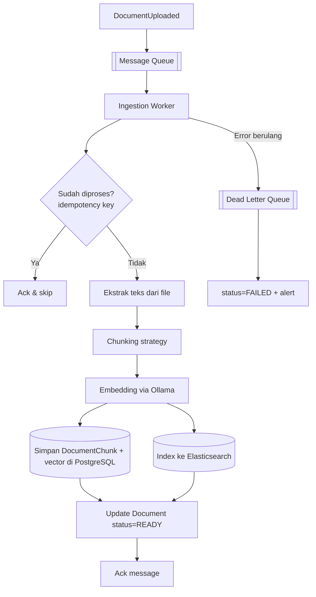
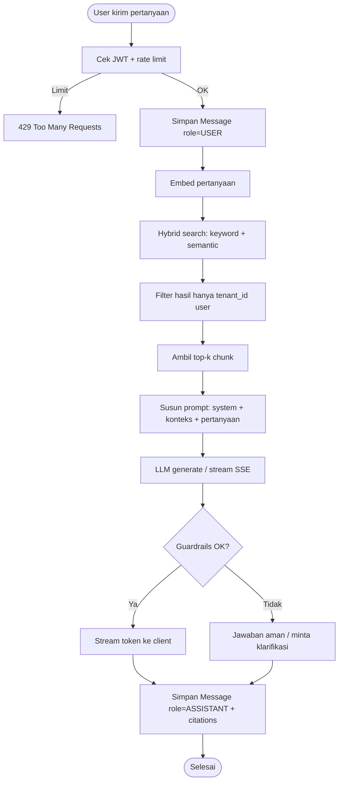
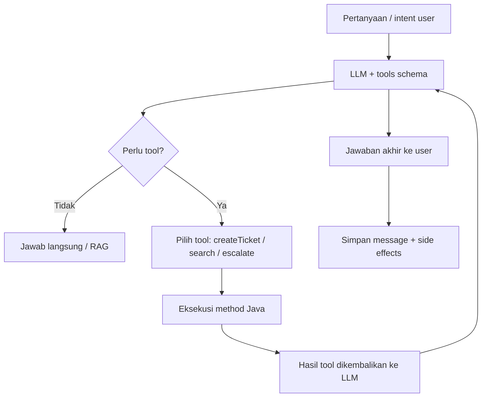
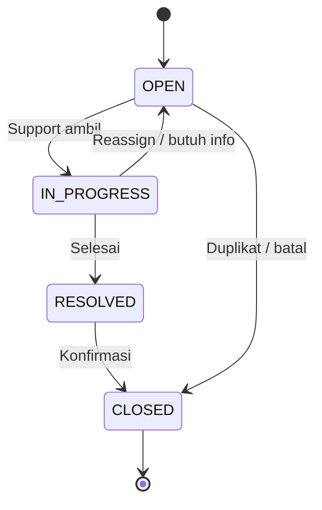
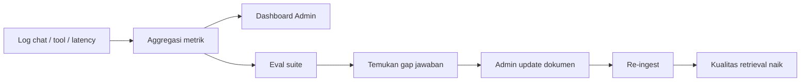

# 03 — Proses Bisnis

Dokumen ini menjelaskan alur bisnis end-to-end Kognita. Setiap proses punya pemicu, langkah, keputusan, dan output.

---

## 1. Peta Proses (Level 0)

---

## 2. BP-01 — Onboarding Tenant & User

**Tujuan:** organisasi baru siap memakai Kognita.

| Item | Detail |
| ---- | ------ |
| Input | `organizationName`, `email`, `password` |
| Output | `tenant`, `user`, `accessToken` |
| SLA | Sinkron &lt; 1s |
| Fase | 1 |

**Sub-proses: invite user (Admin)**

1. Admin buat user (email + role + temporary password / invite link).
2. User login pertama kali.
3. Opsional: wajib ganti password (kebijakan nanti).

---

## 3. BP-02 — Manajemen Dokumen Knowledge

**Tujuan:** knowledge resmi organisasi tersedia untuk AI.

### Status dokumen

| Status | Arti |
| ------ | ---- |
| `UPLOADED` | File tersimpan, belum diproses |
| `PROCESSING` | Sedang di-chunk / embed / index |
| `READY` | Siap dipakai retrieval |
| `FAILED` | Ingestion gagal (bisa retry) |
| `DELETED` | Soft delete / dihapus dari index |

### Operasi lain

- **Update metadata** (judul, tags) — tidak selalu trigger re-ingest.
- **Replace file** — trigger re-ingest; chunk lama dihapus/diganti.
- **Delete** — hapus object storage + metadata + chunk + index entry.

---

## 4. BP-03 — Ingestion Async (Chunk → Embed → Index)

**Tujuan:** mengubah file menjadi potongan knowledge yang searchable.

| Item | Detail |
| ---- | ------ |
| Pemicu | Event setelah upload / reprocess |
| Non-blocking | Upload API tidak menunggu selesai |
| Idempotensi | Consumer memakai `document_id` + `version` / event id |
| Retry | Retry terbatas → DLQ |
| Fase | 3 |

---

## 5. BP-04 — Chat & Jawaban RAG

**Tujuan:** user mendapat jawaban akurat berbasis dokumen tenant.

### Aturan jawaban

1. Prioritaskan konteks dokumen tenant.
2. Jika konteks tidak cukup → akui keterbatasan; tawarkan eskalasi.
3. Sertakan sitasi (document id / filename / chunk).
4. Jangan bocorkan data tenant lain (retrieval sudah di-filter).

---

## 6. BP-05 — Agent Tool Calling & Tiket

**Tujuan:** asisten tidak hanya menjawab, tapi mengeksekusi aksi.

### Contoh skenario bisnis

| Skenario | Tool | Hasil |
| -------- | ---- | ----- |
| "Buatkan tiket: laptop saya rusak" | `createTicket` | Tiket `OPEN` + nomor tiket |
| "Ini di luar knowledge base, hubungi manusia" | `escalate` | Tiket tipe eskalasi |
| "Cari kebijakan cuti tahunan" | `searchKnowledge` | Chunk relevan → jawaban |

### Lifecycle tiket

---

## 7. BP-06 — Analytics & Continuous Improvement

**Tujuan:** admin & operator memperbaiki kualitas knowledge dan AI.

Aktivitas berkala:

- Review pertanyaan tanpa sitasi / low confidence.
- Update dokumen usang.
- Jalankan eval dataset (Fase 4).
- Pantau cost & latency (Langfuse / Prometheus).

---

## 8. Matriks Proses × Entitas

| Proses | Tenant | User | Document | Chunk | Conversation | Message | Ticket |
| ------ | :---: | :---: | :---: | :---: | :---: | :---: | :---: |
| Onboarding | C | C | | | | | |
| Upload knowledge | R | R | C | | | | |
| Ingestion | R | | U | C | | | |
| Chat RAG | R | R | R | R | C/U | C | |
| Agent tiket | R | R | | | R | C | C/U |
| Analytics | R | R | R | | R | R | R |

`C`=create, `R`=read, `U`=update

---

## 9. Exception & Kompensasi

| Kegagalan | Penanganan |
| --------- | ---------- |
| Upload gagal ke MinIO | Transaksi gagal; tidak buat metadata `READY` |
| Metadata tersimpan tapi event hilang | Job reconciliasi status `UPLOADED` lama |
| Ingestion gagal | `FAILED` + retry/DLQ + notifikasi admin |
| LLM timeout | Retry / fallback model / error ramah ke user |
| Tool createTicket gagal | Laporkan ke user; jangan klaim tiket berhasil |
| Rate limit | 429 + `Retry-After` |

---

## 10. Ringkasan SLA Arah Target

| Proses | Ekspektasi |
| ------ | ---------- |
| Login / CRUD ringan | &lt; 300 ms p95 |
| Upload (tanpa ingest) | &lt; 2 s untuk file wajar |
| Ingest → READY | detik–menit tergantung ukuran |
| Chat token pertama (TTFT) | sesingkat mungkin; p95 total &lt; 3 s (Fase 5) |
