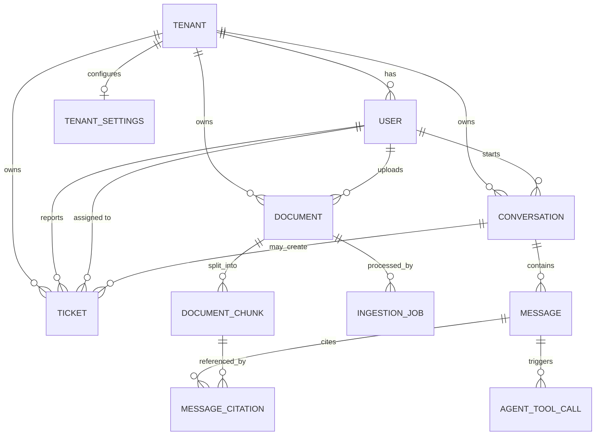

# 04 — Model Data & Relasi Tabel

Dokumen ini adalah **sumber desain skema** Kognita. Implementasi mengikuti fase; kolom bertanda *(Fase X)* muncul di fase tersebut.

---

## 1. Diagram ERD (Logical)



---

## 2. Ringkasan Relasi

| Parent | Child | Kardinalitas | FK | On Delete (usulan) |
| ------ | ----- | ------------ | -- | ------------------ |
| `tenants` | `users` | 1:N | `users.tenant_id` | RESTRICT |
| `tenants` | `documents` | 1:N | `documents.tenant_id` | RESTRICT |
| `tenants` | `conversations` | 1:N | `conversations.tenant_id` | RESTRICT |
| `tenants` | `tickets` | 1:N | `tickets.tenant_id` | RESTRICT |
| `tenants` | `tenant_settings` | 1:1 | `tenant_settings.tenant_id` | CASCADE |
| `users` | `documents` | 1:N | `documents.uploaded_by` | SET NULL |
| `users` | `conversations` | 1:N | `conversations.user_id` | CASCADE |
| `documents` | `document_chunks` | 1:N | `document_chunks.document_id` | CASCADE |
| `documents` | `ingestion_jobs` | 1:N | `ingestion_jobs.document_id` | CASCADE |
| `conversations` | `messages` | 1:N | `messages.conversation_id` | CASCADE |
| `messages` | `message_citations` | 1:N | `message_citations.message_id` | CASCADE |
| `document_chunks` | `message_citations` | 1:N | `message_citations.chunk_id` | SET NULL |
| `conversations` | `tickets` | 1:N | `tickets.conversation_id` | SET NULL |
| `users` | `tickets` (reporter) | 1:N | `tickets.created_by` | SET NULL |
| `users` | `tickets` (assignee) | 1:N | `tickets.assignee_id` | SET NULL |

**Aturan emas multi-tenant:** hampir semua tabel bisnis punya `tenant_id` (kecuali child murni yang selalu diakses lewat parent yang sudah di-scope). Query selalu menyertakan filter tenant.

---

## 3. Spesifikasi Tabel

### 3.1 `tenants` — Fase 1

| Kolom | Tipe | Nullable | Default | Keterangan |
| ----- | ---- | -------- | ------- | ---------- |
| `id` | UUID | NO | gen | PK |
| `name` | VARCHAR(150) | NO | | Nama organisasi |
| `slug` | VARCHAR(100) | NO | | Unique, URL-friendly |
| `status` | VARCHAR(30) | NO | `ACTIVE` | `ACTIVE`, `SUSPENDED` |
| `created_at` | TIMESTAMPTZ | NO | now() | |
| `updated_at` | TIMESTAMPTZ | NO | now() | |

**Index / constraint**

- `uq_tenants_slug` UNIQUE (`slug`)

---

### 3.2 `users` — Fase 1

| Kolom | Tipe | Nullable | Default | Keterangan |
| ----- | ---- | -------- | ------- | ---------- |
| `id` | UUID | NO | gen | PK |
| `tenant_id` | UUID | NO | | FK → tenants |
| `email` | VARCHAR(255) | NO | | Unik per tenant (atau global) |
| `password_hash` | VARCHAR(255) | NO | | BCrypt/Argon2 |
| `full_name` | VARCHAR(150) | YES | | |
| `role` | VARCHAR(30) | NO | `USER` | `ADMIN`, `USER`, `SUPPORT` |
| `status` | VARCHAR(30) | NO | `ACTIVE` | `ACTIVE`, `DISABLED` |
| `created_at` | TIMESTAMPTZ | NO | now() | |
| `updated_at` | TIMESTAMPTZ | NO | now() | |

**Index / constraint**

- `uq_users_tenant_email` UNIQUE (`tenant_id`, `email`)
- `idx_users_tenant_id` (`tenant_id`)

> Keputusan: email unik **per tenant** (boleh email sama di tenant beda). Jika ingin unik global, ganti constraint.

---

### 3.3 `tenant_settings` — Fase 2

| Kolom | Tipe | Nullable | Default | Keterangan |
| ----- | ---- | -------- | ------- | ---------- |
| `tenant_id` | UUID | NO | | PK, FK → tenants |
| `system_prompt` | TEXT | YES | | Prompt asisten |
| `llm_model` | VARCHAR(100) | YES | | Override model |
| `rate_limit_per_minute` | INT | NO | 30 | |
| `max_upload_mb` | INT | NO | 20 | |
| `updated_at` | TIMESTAMPTZ | NO | now() | |

---

### 3.4 `documents` — Fase 1

| Kolom | Tipe | Nullable | Default | Keterangan |
| ----- | ---- | -------- | ------- | ---------- |
| `id` | UUID | NO | gen | PK |
| `tenant_id` | UUID | NO | | FK → tenants |
| `uploaded_by` | UUID | YES | | FK → users |
| `filename` | VARCHAR(255) | NO | | Nama asli |
| `content_type` | VARCHAR(120) | YES | | MIME |
| `size_bytes` | BIGINT | YES | | |
| `storage_key` | VARCHAR(500) | NO | | Path/key di MinIO |
| `status` | VARCHAR(30) | NO | `UPLOADED` | lihat BP-02 |
| `checksum_sha256` | VARCHAR(64) | YES | | Dedup / integritas |
| `version` | INT | NO | 1 | Naik saat replace |
| `error_message` | TEXT | YES | | Jika `FAILED` |
| `created_at` | TIMESTAMPTZ | NO | now() | |
| `updated_at` | TIMESTAMPTZ | NO | now() | |

**Index / constraint**

- `idx_documents_tenant_status` (`tenant_id`, `status`)
- `idx_documents_tenant_created` (`tenant_id`, `created_at` DESC)
- `uq_documents_tenant_storage` UNIQUE (`tenant_id`, `storage_key`) opsional

---

### 3.5 `document_chunks` — Fase 3

| Kolom | Tipe | Nullable | Default | Keterangan |
| ----- | ---- | -------- | ------- | ---------- |
| `id` | UUID | NO | gen | PK |
| `tenant_id` | UUID | NO | | Denormalized untuk filter cepat |
| `document_id` | UUID | NO | | FK → documents |
| `chunk_index` | INT | NO | | Urutan dalam dokumen |
| `content` | TEXT | NO | | Teks chunk |
| `token_count` | INT | YES | | Estimasi |
| `embedding` | VECTOR(768) | YES | | Dimensi menyesuaikan model |
| `metadata` | JSONB | YES | | page, heading, dll |
| `created_at` | TIMESTAMPTZ | NO | now() | |

**Index / constraint**

- `uq_chunks_document_index` UNIQUE (`document_id`, `chunk_index`)
- `idx_chunks_tenant_document` (`tenant_id`, `document_id`)
- IVFFlat / HNSW index pada `embedding` (pgvector)

> Dimensi embedding tergantung model (contoh `nomic-embed-text` ≈ 768). Sesuaikan di migrasi.

---

### 3.6 `ingestion_jobs` — Fase 3

| Kolom | Tipe | Nullable | Default | Keterangan |
| ----- | ---- | -------- | ------- | ---------- |
| `id` | UUID | NO | gen | PK |
| `tenant_id` | UUID | NO | | |
| `document_id` | UUID | NO | | FK |
| `event_id` | VARCHAR(100) | NO | | Idempotency key |
| `status` | VARCHAR(30) | NO | `PENDING` | `PENDING`, `RUNNING`, `SUCCESS`, `FAILED` |
| `attempt` | INT | NO | 0 | |
| `started_at` | TIMESTAMPTZ | YES | | |
| `finished_at` | TIMESTAMPTZ | YES | | |
| `error_message` | TEXT | YES | | |
| `created_at` | TIMESTAMPTZ | NO | now() | |

**Index / constraint**

- `uq_ingestion_event_id` UNIQUE (`event_id`)
- `idx_ingestion_document` (`document_id`)

---

### 3.7 `conversations` — Fase 2

| Kolom | Tipe | Nullable | Default | Keterangan |
| ----- | ---- | -------- | ------- | ---------- |
| `id` | UUID | NO | gen | PK |
| `tenant_id` | UUID | NO | | FK |
| `user_id` | UUID | NO | | FK → users |
| `title` | VARCHAR(255) | YES | | Auto dari pertanyaan pertama |
| `status` | VARCHAR(30) | NO | `ACTIVE` | `ACTIVE`, `ARCHIVED` |
| `created_at` | TIMESTAMPTZ | NO | now() | |
| `updated_at` | TIMESTAMPTZ | NO | now() | |

**Index**

- `idx_conversations_tenant_user` (`tenant_id`, `user_id`, `updated_at` DESC)

---

### 3.8 `messages` — Fase 2

| Kolom | Tipe | Nullable | Default | Keterangan |
| ----- | ---- | -------- | ------- | ---------- |
| `id` | UUID | NO | gen | PK |
| `tenant_id` | UUID | NO | | Denormalized |
| `conversation_id` | UUID | NO | | FK |
| `role` | VARCHAR(30) | NO | | `USER`, `ASSISTANT`, `SYSTEM`, `TOOL` |
| `content` | TEXT | NO | | |
| `token_usage` | INT | YES | | Opsional |
| `model` | VARCHAR(100) | YES | | Model yang dipakai |
| `created_at` | TIMESTAMPTZ | NO | now() | |

**Index**

- `idx_messages_conversation_created` (`conversation_id`, `created_at`)

---

### 3.9 `message_citations` — Fase 3

| Kolom | Tipe | Nullable | Default | Keterangan |
| ----- | ---- | -------- | ------- | ---------- |
| `id` | UUID | NO | gen | PK |
| `message_id` | UUID | NO | | FK → messages |
| `chunk_id` | UUID | YES | | FK → document_chunks |
| `document_id` | UUID | YES | | Redundan untuk tampilan |
| `score` | DOUBLE PRECISION | YES | | Similarity / rank score |
| `snippet` | TEXT | YES | | Cuplikan yang dikutip |

---

### 3.10 `tickets` — Fase 4

| Kolom | Tipe | Nullable | Default | Keterangan |
| ----- | ---- | -------- | ------- | ---------- |
| `id` | UUID | NO | gen | PK |
| `tenant_id` | UUID | NO | | FK |
| `number` | BIGSERIAL / BIGINT | NO | | Nomor tiket per tenant (lihat catatan) |
| `title` | VARCHAR(255) | NO | | |
| `description` | TEXT | YES | | |
| `status` | VARCHAR(30) | NO | `OPEN` | `OPEN`, `IN_PROGRESS`, `RESOLVED`, `CLOSED` |
| `priority` | VARCHAR(20) | NO | `MEDIUM` | `LOW`, `MEDIUM`, `HIGH`, `URGENT` |
| `type` | VARCHAR(30) | NO | `GENERAL` | `GENERAL`, `ESCALATION` |
| `created_by` | UUID | YES | | FK users |
| `assignee_id` | UUID | YES | | FK users |
| `conversation_id` | UUID | YES | | FK conversations |
| `created_at` | TIMESTAMPTZ | NO | now() | |
| `updated_at` | TIMESTAMPTZ | NO | now() | |

**Index / constraint**

- `uq_tickets_tenant_number` UNIQUE (`tenant_id`, `number`)
- `idx_tickets_tenant_status` (`tenant_id`, `status`)

> Nomor tiket per tenant: pakai sequence per tenant atau tabel counter; hindari `BIGSERIAL` global jika ingin nomor mulai dari 1 per organisasi.

---

### 3.11 `agent_tool_calls` — Fase 4 (audit)

| Kolom | Tipe | Nullable | Default | Keterangan |
| ----- | ---- | -------- | ------- | ---------- |
| `id` | UUID | NO | gen | PK |
| `tenant_id` | UUID | NO | | |
| `message_id` | UUID | YES | | Message ASSISTANT/TOOL terkait |
| `conversation_id` | UUID | NO | | |
| `tool_name` | VARCHAR(100) | NO | | mis. `createTicket` |
| `arguments_json` | JSONB | YES | | |
| `result_json` | JSONB | YES | | |
| `status` | VARCHAR(30) | NO | | `SUCCESS`, `FAILED` |
| `latency_ms` | INT | YES | | |
| `created_at` | TIMESTAMPTZ | NO | now() | |

---

### 3.12 `usage_events` — Fase 4/5 (metering)

| Kolom | Tipe | Nullable | Default | Keterangan |
| ----- | ---- | -------- | ------- | ---------- |
| `id` | UUID | NO | gen | PK |
| `tenant_id` | UUID | NO | | |
| `user_id` | UUID | YES | | |
| `event_type` | VARCHAR(50) | NO | | `CHAT`, `EMBED`, `UPLOAD` |
| `quantity` | INT | NO | 1 | token / request |
| `metadata` | JSONB | YES | | |
| `created_at` | TIMESTAMPTZ | NO | now() | |

**Index:** `idx_usage_tenant_created` (`tenant_id`, `created_at`)

---

## 4. Diagram Relasi Fisik (Ringkas)

```
tenants
  ├── tenant_settings (1:1)
  ├── users (1:N)
  ├── documents (1:N)
  │     ├── document_chunks (1:N)
  │     └── ingestion_jobs (1:N)
  ├── conversations (1:N)
  │     └── messages (1:N)
  │           ├── message_citations (1:N) ──► document_chunks
  │           └── agent_tool_calls (1:N)
  ├── tickets (1:N) ──► conversations?, users?
  └── usage_events (1:N)
```

---

## 5. Enum / Domain Values

| Domain | Nilai |
| ------ | ----- |
| `user.role` | `ADMIN`, `USER`, `SUPPORT` |
| `user.status` | `ACTIVE`, `DISABLED` |
| `tenant.status` | `ACTIVE`, `SUSPENDED` |
| `document.status` | `UPLOADED`, `PROCESSING`, `READY`, `FAILED`, `DELETED` |
| `message.role` | `USER`, `ASSISTANT`, `SYSTEM`, `TOOL` |
| `ticket.status` | `OPEN`, `IN_PROGRESS`, `RESOLVED`, `CLOSED` |
| `ticket.priority` | `LOW`, `MEDIUM`, `HIGH`, `URGENT` |
| `ingestion_job.status` | `PENDING`, `RUNNING`, `SUCCESS`, `FAILED` |

Disarankan: PostgreSQL `CHECK` atau tipe ENUM; di Java pakai enum mirror.

---

## 6. Strategi Multi-Tenant di Skema

| Pendekatan | Dipakai? | Catatan |
| ---------- | -------- | ------- |
| Shared DB + `tenant_id` column | **Ya (default)** | Sederhana, cocok Fase 1–4 |
| Schema per tenant | Tidak dulu | Lebih isolasi, lebih kompleks |
| DB per tenant | Tidak dulu | Biaya operasional tinggi |

**Wajib:**

1. Setiap SELECT/UPDATE/DELETE bisnis menyertakan `tenant_id`.
2. Jangan percaya `tenant_id` dari body request — ambil dari JWT.
3. Child table tanpa `tenant_id` hanya boleh diakses lewat join parent yang sudah di-scope.

---

## 7. Objek di Luar PostgreSQL

| Store | Data | Key pattern (contoh) |
| ----- | ---- | -------------------- |
| MinIO | File mentah | `{tenantId}/{documentId}/{filename}` |
| Elasticsearch | Index full-text + vector (opsional) | index `kognita_chunks`, field `tenant_id` wajib di setiap doc |
| Redis | Rate limit, cache retrieval | `rl:{tenantId}:{userId}`, `cache:rag:...` |

---

## 8. Migrasi per Fase (Flyway usulan)

| Versi | Isi |
| ----- | --- |
| `V1__tenants_users_documents.sql` | tenants, users, documents |
| `V2__conversations_messages.sql` | conversations, messages, tenant_settings |
| `V3__pgvector_chunks_ingestion.sql` | extension vector, document_chunks, ingestion_jobs, citations |
| `V4__tickets_agent_usage.sql` | tickets, agent_tool_calls, usage_events |

---

## 9. Contoh Query Berpola Tenant-Safe

```sql
-- List dokumen tenant dari JWT
SELECT *
FROM documents
WHERE tenant_id = :tenantId
  AND status <> 'DELETED'
ORDER BY created_at DESC;

-- Retrieval chunk (setelah vector search / join)
SELECT c.*
FROM document_chunks c
JOIN documents d ON d.id = c.document_id
WHERE c.tenant_id = :tenantId
  AND d.status = 'READY'
ORDER BY c.embedding <=> :queryEmbedding
LIMIT :k;
```

---

## 10. Catatan Desain

1. **UUID** untuk PK publik agar tidak enumerable antar tenant.
2. **Denormalize `tenant_id`** pada chunk/message untuk performa filter & keamanan.
3. **Soft delete dokumen** (`DELETED`) memudahkan audit; hard delete object storage bisa async.
4. **Embedding nullable** selama proses ingest berjalan.
5. Perubahan skema material → catat di ADR (`docs/adr/`).
