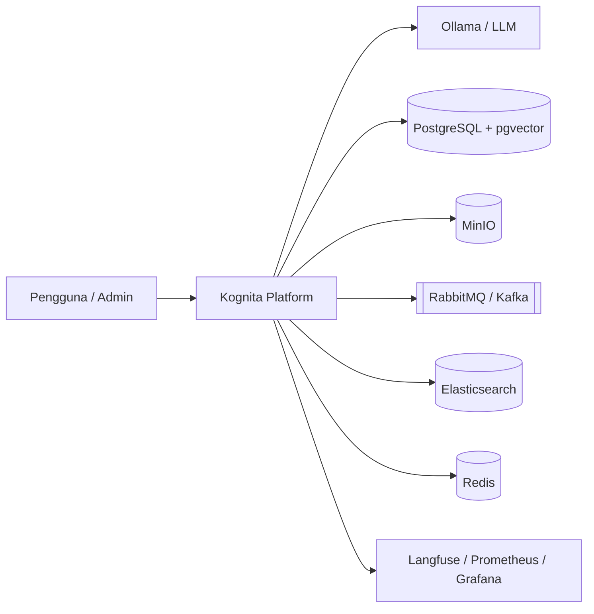
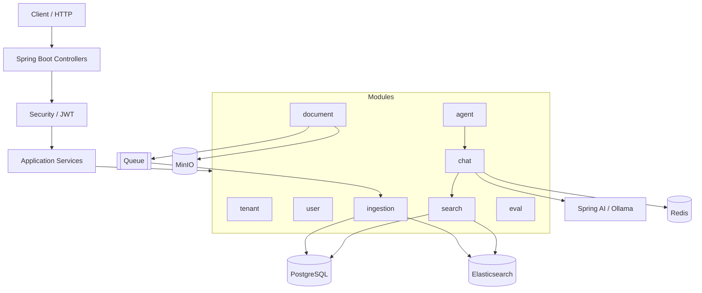
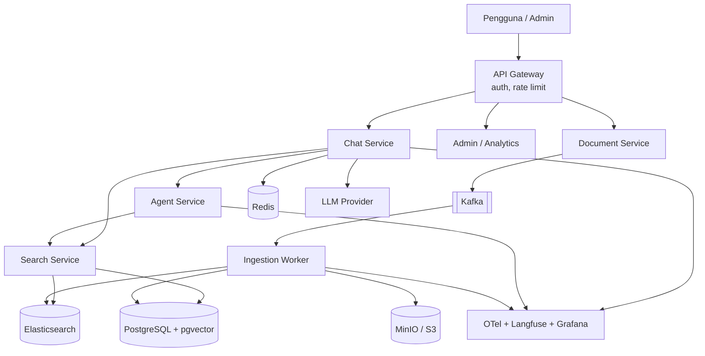

# 05 — Arsitektur Sistem

## 1. Prinsip Arsitektur

1. **Start modular monolith** (Fase 1–4), pecah service hanya saat ada alasan jelas (Fase 5 + ADR).
2. **Async untuk kerja berat** — ingestion tidak di request thread.
3. **Tenant isolation di setiap lapisan** — API, service, query, index, storage key.
4. **AI sebagai dependency tidak stabil** — timeout, retry, fallback, observability.
5. **Keputusan tertulis** — ADR untuk trade-off penting.

---

## 2. Konteks Sistem (C4 Level 1)



---

## 3. Arsitektur Fase 1–4 (Modular Monolith)



### Struktur paket

```
com.kognita/
├── config/
├── tenant/
├── user/
├── document/
├── ingestion/
├── search/
├── chat/
├── agent/
├── eval/
└── common/
```

Tiap modul idealnya punya: `controller` / `service` / `repository` / `dto` / `entity` (sesuai kebutuhan).

---

## 4. Arsitektur Target Fase 5 (Microservices)



Pemisahan hanya dilakukan jika ada alasan: scaling berbeda, deploy independen, atau ownership tim — ditulis di ADR.

---

## 5. Alur Runtime Utama

### 5.1 Upload dokumen

```
Client → API Gateway/Controller → DocumentService
  → MinIO putObject
  → DB insert documents(UPLOADED)
  → publish DocumentUploaded
  → 201/200 response
Queue → IngestionWorker → chunks + embeddings + index → READY
```

### 5.2 Chat RAG

```
Client → ChatController (SSE)
  → rate limit (Redis)
  → save user message
  → SearchService.hybridSearch(tenantId, query)
  → build prompt
  → ChatClient.stream(...)
  → save assistant message + citations
```

### 5.3 Agent

```
Chat → Agent loop
  → LLM chooses tool
  → execute Java @Tool method (tenant-scoped)
  → feed result back to LLM
  → final answer
```

---

## 6. Tech Stack per Lapisan

| Lapisan | Teknologi |
| ------- | --------- |
| Language | Java 21 |
| Framework | Spring Boot 3.x, Spring Security, Spring Data JPA |
| AI | Spring AI + Ollama (`llama*`, `nomic-embed-text`) |
| DB | PostgreSQL + pgvector |
| Cache / limit | Redis |
| Queue | RabbitMQ (awal) → Kafka (skala) |
| Search | Elasticsearch / OpenSearch |
| Object storage | MinIO |
| Migration | Flyway |
| Test | JUnit, Testcontainers |
| Obs | Langfuse, OpenTelemetry, Prometheus, Grafana |
| Deploy | Docker Compose → Kubernetes + Terraform (Fase 5) |

---

## 7. Cross-Cutting Concerns

| Concern | Pendekatan |
| ------- | ---------- |
| AuthN | JWT Bearer |
| AuthZ | Role + tenant scope |
| Validasi | Bean Validation |
| Error | `@ControllerAdvice` + problem detail |
| Idempotency | `event_id` di ingestion |
| Observability | trace id di log + Langfuse generations |
| Config | `application.yml` + env vars |
| Secrets | env / secret manager (jangan commit) |

---

## 8. Deployment Views

### Development (Fase 1)

```
docker-compose: PostgreSQL + MinIO
app: spring-boot:run di host
```

### Development lengkap (Fase 3–4)

```
docker-compose: Postgres, Redis, RabbitMQ, Elasticsearch, MinIO, Ollama*, Langfuse
app monolith
```

\*Ollama bisa native di host untuk akses GPU/lebih mudah.

### Production arah (Fase 5)

```
K8s cluster: gateway + services + workers
Managed PG / Redis opsional
CI/CD GitHub Actions
IaC Terraform
```

---

## 9. Trade-off Ringkas

| Keputusan | Pro | Kontra |
| --------- | --- | ------ |
| Modular monolith dulu | Cepat deliver, transaksi lokal mudah | Batas scale per modul |
| pgvector di Postgres | Satu DB, ops sederhana | Scale vector sangat besar bisa terbatas |
| Hybrid ES + PG | Keyword kuat + semantic | Dua store harus konsisten |
| LLM lokal | Gratis, offline | Kualitas/latency tergantung hardware |
| Shared DB multi-tenant | Sederhana | Butuh disiplin filter tenant |

Detail keputusan besar → `docs/adr/`.
