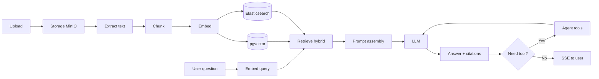
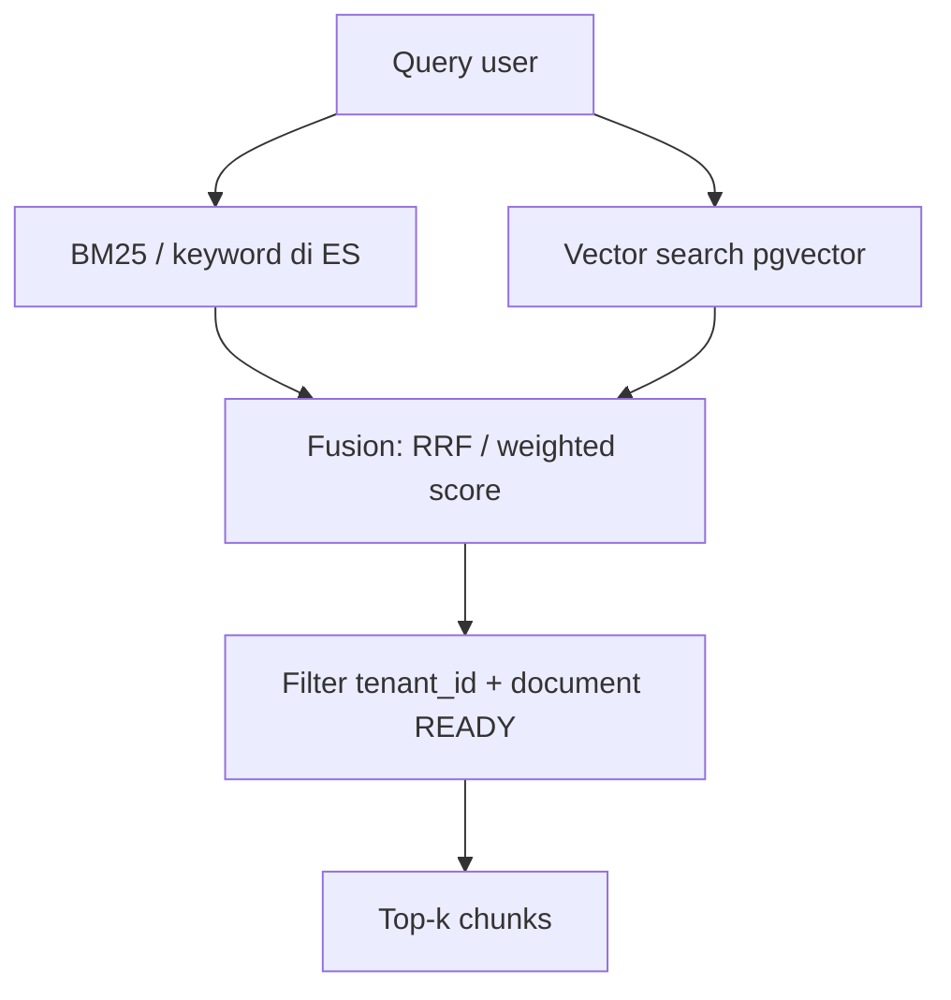

# 08 — Pipeline RAG & AI

## 1. Tujuan

Mengubah dokumen tenant menjadi konteks yang bisa diambil saat chat, lalu menghasilkan jawaban yang:

- relevan terhadap knowledge resmi,
- dilengkapi sitasi,
- terukur kualitasnya (evals),
- bisa memicu aksi (agent tools).

---

## 2. Pipeline End-to-End



---

## 3. Ingestion Detail

### 3.1 Extract

| Format | Pendekatan usulan |
| ------ | ----------------- |
| `.txt` / `.md` | Baca langsung |
| `.pdf` | PDFBox / library extract |
| `.docx` | Apache POI |

Gagal extract → `document.status = FAILED`.

### 3.2 Chunking

Tujuan: potongan cukup kecil untuk precision, cukup besar untuk konteks.

| Parameter | Nilai awal (boleh di-tune) |
| --------- | -------------------------- |
| Target size | 400–800 token |
| Overlap | 10–20% |
| Boundary | Utamakan paragraf / heading |

Metadata chunk: `page`, `heading`, `documentId`, `tenantId`, `chunkIndex`.

### 3.3 Embedding

- Model: `nomic-embed-text` via Ollama (dev).
- Simpan vector di `document_chunks.embedding`.
- Batch embed untuk efisiensi.
- Dimension harus konsisten dengan kolom `VECTOR(n)`.

### 3.4 Indexing

- **PostgreSQL/pgvector:** semantic ANN search.
- **Elasticsearch:** BM25 keyword (+ dense vector opsional).
- Kedua store harus dihapus/update saat dokumen dihapus atau di-reprocess.

### 3.5 Idempotency

- Tiap event punya `event_id` unik.
- Reprocess: hapus chunk lama dokumen → tulis baru → bump `documents.version`.

---

## 4. Retrieval (Hybrid Search)



| Parameter | Awal |
| --------- | ---- |
| `topK` | 4–8 |
| Min score | Opsional threshold |
| Diversifikasi | Batasi chunk dari dokumen yang sama |

Jika hasil kosong / score rendah → LLM diminta jawab “tidak ditemukan di knowledge” + tawarkan eskalasi.

---

## 5. Prompt Assembly (RAG)

Urutan pesan tipikal:

1. **System** — dari `tenant_settings.system_prompt` + aturan sitasi.
2. **Context** — chunk terformat:

```text
[Source 1 | policy.pdf | chunk 3]
...teks...

[Source 2 | handbook.md | chunk 1]
...teks...
```

3. **User** — pertanyaan aktual.
4. (Opsional) riwayat conversation terpotong sesuai window.

Instruksi penting:

- Jawab hanya dari konteks bila policy ketat.
- Sertakan nomor sumber.
- Jika tidak yakin, katakan tidak yakin.

---

## 6. Streaming Chat

- Spring AI `ChatClient` + `Flux` / SSE.
- Simpan jawaban final setelah stream selesai (atau buffer).
- Citations bisa dikirim event terpisah di akhir / paralel.

Metrik: TTFT (time to first token), total latency, token usage.

---

## 7. Agent & Tool Calling

### Tools awal

| Tool | Input | Side effect |
| ---- | ----- | ----------- |
| `searchKnowledge` | query, topK | read-only |
| `createTicket` | title, description, priority | insert `tickets` |
| `escalateToHuman` | reason, conversationId | ticket type `ESCALATION` |

### Loop

```
while LLM requests tool && iterations < max:
  execute tool (tenant-scoped)
  append tool result
LLM final answer
```

Batasi `max iterations` (mis. 3–5) untuk cegah loop.

---

## 8. Guardrails

| Jenis | Contoh |
| ----- | ------ |
| Input | Tolak prompt terlalu panjang; filter abuse dasar |
| Retrieval | Hanya chunk tenant sendiri |
| Output | Validasi ada sitasi jika klaim faktual dari dokumen |
| Tool | Allowlist; validasi argumen; authz |
| Fallback | Model secondary jika primary error |

---

## 9. Evals (Fase 4)

Dataset sederhana:

| id | question | expected_doc | notes |
| -- | -------- | ------------ | ----- |
| 1 | Berapa cuti tahunan? | policy.pdf | harus sitasi |

Metrik arah:

- **Faithfulness** — jawaban didukung konteks
- **Relevance** — menjawab pertanyaan
- **Retrieval hit** — chunk benar masuk top-k
- **Latency / cost**

Jalankan eval di CI berkala atau job manual; simpan skor di laporan (bukan wajib di DB awal).

---

## 10. Observability AI

| Sinyal | Tool |
| ------ | ---- |
| Trace prompt → retrieve → generate | Langfuse / OTel |
| Token & cost | Langfuse |
| Latency p95 chat | Prometheus + Grafana |
| Error rate LLM/tools | Metrics + logs |

Setiap generasi idealnya punya `traceId`, `tenantId`, `conversationId` (jangan kirim PII berlebih ke pihak ketiga tanpa kebijakan).

---

## 11. Kegagalan & Degradasi

| Kondisi | Perilaku |
| ------- | -------- |
| Belum ada dokumen READY | Chat tetap jalan (umum) atau mode “knowledge kosong” |
| ES down | Fallback vector-only |
| pgvector lambat | Kurangi topK / cache query populer |
| Ollama down | 503 ramah + retry/fallback cloud (jika dikonfigurasi) |
| Ingest tertinggal | UI tampilkan status dokumen |

---

## 12. Checklist Kualitas RAG

- [ ] Chunk overlap cukup, tidak memotong kalimat penting berlebihan
- [ ] Metadata page/heading tersimpan
- [ ] Filter tenant di retrieval teruji
- [ ] Sitasi muncul di UI/API
- [ ] Reprocess & delete membersihkan index
- [ ] Eval set kecil jalan sebelum klaim “akurat”
