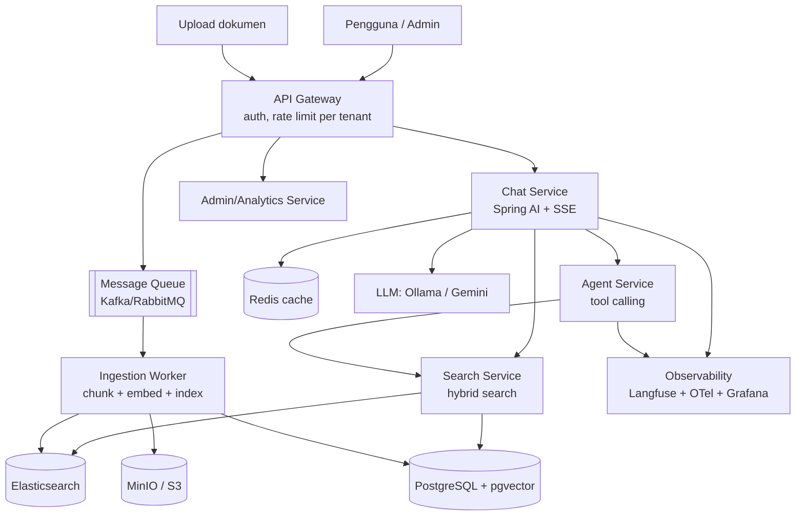

# Rencana Proyek: Kognita — AI Knowledge & Support Platform

> Proyek capstone belajar **Backend + AI Engineer** (Java, junior → senior).
> Dibangun bertahap dalam 5 fase. Semua alat development **gratis** (Ollama + Docker + PostgreSQL).
> Tiap fase berdiri sendiri sebagai portofolio.
>
> **Dokumentasi desain lengkap** (proses bisnis, ERD, API, security, RAG): lihat `[docs/README.md](./README.md)`.

---

## 1. Ringkasan Proyek

**Apa itu Kognita?**
Platform SaaS multi-tenant di mana sebuah organisasi meng-upload dokumen/knowledge mereka, lalu pengguna bertanya ke asisten AI yang:

- **Menjawab berbasis dokumen** (RAG — Retrieval-Augmented Generation), dan
- **Bertindak** (agent — membuat tiket, mencari data, mengeskalasi ke manusia).

Dilengkapi panel admin, analitik penggunaan, dan billing per tenant.

**Kenapa proyek ini?**
Satu proyek ini secara alami menyentuh **ke-14 jalur** roadmap: API, database, caching, messaging, search, sistem terdistribusi, cloud, observability, security, AI/LLM, AI in production, dan keputusan arsitektur.

---


## 2. Tujuan Belajar

Di akhir proyek kamu akan mampu:

- Membangun REST/gRPC API kelas produksi dengan Spring Boot.
- Mendesain skema database & mengoptimalkan query PostgreSQL.
- Membangun sistem RAG lengkap (embedding, vector search, hybrid search).
- Membuat agent LLM dengan tool calling.
- Menangani sifat non-deterministik LLM (evals, guardrails, monitoring).
- Membangun pipeline async event-driven (message queue).
- Men-deploy sistem microservices ke cloud dengan observability.
- **Mengambil keputusan arsitektur & menjelaskan trade-off-nya** (skill senior).

---


## 3. Prinsip Pengerjaan (Aturan Mentor)

1. **Tiap fase harus benar-benar jalan & bisa didemo** sebelum lanjut. Satu proyek jadi > sepuluh setengah jadi.
2. **Tulis inti logika sendiri dulu, baru minta AI review.** AI mempercepat, bukan menggantikan berpikir.
3. **Belajar didorong kebutuhan.** Tambahkan Kafka/Redis/Elasticsearch saat proyek *butuh*, bukan karena ada di daftar.
4. **Commit kecil & sering.** Tulis pesan commit yang menjelaskan "kenapa".
5. **Dokumentasikan keputusan** dalam ADR (Architecture Decision Record) sederhana — latihan berpikir senior.
6. **Setiap fitur ada testnya.** Non-negotiable.

---


## 4. Tech Stack (Semua Gratis untuk Development)


| Kategori              | Pilihan                                   | Biaya          | Catatan                        |
| --------------------- | ----------------------------------------- | -------------- | ------------------------------ |
| Bahasa                | Java 21 (LTS)                             | Gratis         | Virtual threads (Loom)         |
| Framework             | Spring Boot 3.x                           | Gratis         |                                |
| AI framework          | Spring AI                                 | Gratis         | Ganti provider tanpa ubah kode |
| LLM (lokal)           | Ollama (Llama 3.1 / Qwen 2.5)             | **Gratis**     | Tanpa API key, jalan di laptop |
| Embedding             | nomic-embed-text (via Ollama)             | **Gratis**     | Untuk RAG                      |
| LLM cloud (opsional)  | Google Gemini / Groq free tier            | Gratis*        | Kalau mau model lebih pintar   |
| Database              | PostgreSQL + pgvector                     | Gratis         | Vektor langsung di Postgres    |
| Cache                 | Redis                                     | Gratis         | Docker                         |
| Message queue         | Kafka                                     | Gratis         | Docker                         |
| Search                | Elasticsearch/OpenSearch                  | Gratis         | Docker                         |
| Object storage        | MinIO (S3-compatible)                     | Gratis         | Pengganti S3 lokal             |
| Observability         | Langfuse (self-host), Prometheus, Grafana | Gratis         | Docker                         |
| Container             | Docker + Docker Compose                   | Gratis         |                                |
| Orkestrasi            | Kubernetes (kind/minikube lokal)          | Gratis         | Fase 5                         |
| IaC                   | Terraform                                 | Gratis         | Fase 5                         |
| IDE + AI              | Cursor                                    | (langganan)    |                                |
| Cloud (deploy publik) | AWS free tier                             | Gratis 12 bln* | Hanya di Fase 5, opsional      |


 Free tier bisa berubah; Ollama + Docker tak bergantung pihak ketiga.

**Prinsip:** semua Fase 1–4 bisa dikerjakan **100% gratis & offline** di laptop. Biaya baru muncul (opsional) di Fase 5 saat deploy ke internet.

---


## 5. Arsitektur (Bentuk Akhir — Fase 5)




**Catatan:** di Fase 1–4 ini masih **monolith** (satu aplikasi Spring Boot). Pemisahan menjadi microservices baru dilakukan di Fase 5 — dan hanya jika kamu paham *kenapa*.

---


## 6. Struktur Folder (Evolusi Bertahap)

**Fase 1–4 (monolith modular):**

```
kognita/
├── docker-compose.yml          # postgres, redis, rabbitmq, elasticsearch, minio
├── pom.xml                     # atau build.gradle
├── README.md
├── docs/
│   └── adr/                    # Architecture Decision Records
└── src/main/java/com/kognita/
    ├── KognitaApplication.java
    ├── config/                 # konfigurasi Spring, AI, security
    ├── tenant/                 # multi-tenant: entity, service
    ├── user/                   # auth & user
    ├── document/               # upload, CRUD dokumen
    ├── ingestion/              # chunk, embed, index (Fase 3)
    ├── search/                 # hybrid search (Fase 3)
    ├── chat/                   # percakapan + LLM (Fase 2)
    ├── agent/                  # tool calling (Fase 4)
    ├── eval/                   # evals kualitas jawaban (Fase 4)
    └── common/                 # error handling, util
```

**Fase 5:** pecah modul menjadi service terpisah (gateway, chat-service, ingestion-worker, search-service, dst).

---


## 7. Rincian Per Fase


### FASE 1 — Fondasi (Monolith) · Level: Junior

**Tujuan:** API backend solid dengan auth, database, dan upload dokumen.

**Fitur:**

- Registrasi & login (JWT).
- Multi-tenant dasar (setiap user milik satu organisasi).
- Upload dokumen (simpan metadata di PostgreSQL, file di MinIO).
- CRUD dokumen dengan otorisasi per tenant.

**Tugas teknis:**

- [ ] Setup project Spring Boot + `docker-compose` (PostgreSQL, MinIO).
- [ ] Entity: `Tenant`, `User`, `Document` + migrasi (Flyway).
- [ ] Auth: registrasi, login, JWT, Spring Security.
- [ ] Endpoint upload → simpan file ke MinIO, metadata ke DB.
- [ ] Endpoint CRUD dokumen dengan filter per tenant.
- [ ] Validasi input & error handling terstruktur (`@ControllerAdvice`).
- [ ] Unit test + integration test (Testcontainers).

**Konsep dipelajari:** REST design, Spring Boot, JPA/Hibernate, PostgreSQL, JWT/OAuth2, OWASP dasar, testing.

**Definition of Done:** bisa daftar, login, upload dokumen, dan hanya melihat dokumen tenant sendiri — semua ada testnya dan jalan via `docker-compose up`.

**Cursor:** pakai **Plan mode** untuk desain skema DB & endpoint sebelum coding. Tulis service layer sendiri, minta AI review keamanan & edge case.

---


### FASE 2 — Chat LLM + Streaming · Level: Junior→Mid

**Tujuan:** integrasi LLM pertama dengan jawaban streaming.

**Fitur:**

- Endpoint chat: kirim pertanyaan → jawaban LLM streaming (SSE).
- Riwayat percakapan tersimpan.
- System prompt yang bisa dikonfigurasi per tenant.

**Tugas teknis:**

- [ ] Tambah Ollama ke `docker-compose` (atau jalankan native).
- [ ] Integrasi Spring AI `ChatClient` dengan Ollama.
- [ ] Endpoint chat streaming via SSE (`Flux<String>`).
- [ ] Entity `Conversation` & `Message`.
- [ ] Structured output: contoh endpoint yang mengembalikan POJO dari LLM.
- [ ] Prompt engineering: system prompt, few-shot.
- [ ] Redis untuk cache & rate limit per tenant.

**Konsep dipelajari:** LLM fundamentals (token, context, temperature), prompt engineering, structured output, streaming (SSE/Flux), caching, rate limiting.

**Definition of Done:** bisa chat dengan asisten AI (jawaban muncul streaming), riwayat tersimpan, ada rate limit per tenant.

**Cursor:** minta AI menjelaskan konsep embedding/token, lalu uji pemahamanmu (Feynman terbalik).

---


### FASE 3 — RAG + Ingestion Async · Level: Mid

**Tujuan:** asisten menjawab **berdasarkan dokumen yang diupload**.

**Fitur:**

- Dokumen diproses async: chunk → embed → index.
- Pertanyaan dijawab dengan konteks dokumen relevan (RAG).
- Hybrid search (keyword + semantic).

**Tugas teknis:**

- [ ] Tambah RabbitMQ + Elasticsearch + pgvector ke `docker-compose`.
- [ ] Setelah upload → kirim event ke queue (jangan proses di request).
- [ ] Ingestion worker: ekstrak teks, chunking, embedding (nomic-embed-text via Ollama), simpan vektor.
- [ ] Retrieval: cari chunk relevan (top-k) untuk pertanyaan.
- [ ] Susun prompt RAG (konteks + pertanyaan) → LLM.
- [ ] Hybrid search di Elasticsearch (keyword + vektor).
- [ ] Idempotent consumer + dead letter queue.

**Konsep dipelajari:** RAG, embedding, vector search, chunking strategy, message queue, event-driven, idempotency, Elasticsearch.

**Definition of Done:** upload dokumen → tanya isinya → dapat jawaban akurat dengan sitasi sumber. Ingestion berjalan async tanpa memblokir upload.

**Cursor:** desain strategi chunking bareng AI, bandingkan pendekatan, tapi ukur sendiri kualitasnya.

---


### FASE 4 — Agent + Evals + Observability · Level: Mid→Senior

**Tujuan:** asisten bisa **bertindak**, dan kamu bisa **mengukur & memantau** kualitasnya.

**Fitur:**

- Agent dengan tools: buat tiket, cari data, eskalasi ke manusia.
- Evals otomatis untuk kualitas jawaban.
- Guardrails & penanganan halusinasi.
- Monitoring biaya, latency, tracing.

**Tugas teknis:**

- [ ] Definisikan tools (`@Tool`) yang memanggil method Java (mis. `createTicket`).
- [ ] Agent loop: LLM memutuskan tool → eksekusi → lanjut.
- [ ] Eval suite: dataset pertanyaan-jawaban, ukur akurasi/relevansi.
- [ ] Guardrails: validasi output, tolak jawaban di luar konteks.
- [ ] Integrasi Langfuse untuk tracing & cost.
- [ ] Distributed tracing (OpenTelemetry) + metrics (Prometheus/Grafana).
- [ ] Retry & fallback (mis. Ollama gagal → model lain).

**Konsep dipelajari:** tool/function calling, agents, evals, guardrails, LLM observability, cost/latency monitoring, resilience.

**Definition of Done:** asisten bisa membuat tiket lewat percakapan; ada dashboard yang menampilkan latency, biaya, dan skor kualitas jawaban.

**Cursor:** pakai review AI (Bugbot/security review) pada perubahanmu untuk belajar pola bug.

---


### FASE 5 — Microservices di Cloud · Level: Senior

**Tujuan:** ubah menjadi sistem terdistribusi kelas produksi & deploy.

**Fitur:**

- Pisahkan menjadi service: gateway, chat, ingestion, search, analytics.
- Deploy ke Kubernetes.
- Infrastructure as Code.
- SLO & strategi deployment aman.

**Tugas teknis:**

- [ ] Pecah monolith menjadi service (dengan alasan yang jelas — tulis ADR).
- [ ] Komunikasi antar-service (gRPC / event via Kafka).
- [ ] Containerize tiap service, deploy ke Kubernetes (kind/minikube lokal → AWS EKS).
- [ ] CI/CD (GitHub Actions): build, test, deploy.
- [ ] Terraform untuk infrastruktur.
- [ ] SLO/SLI (mis. p95 latency chat < 3s), error budget.
- [ ] Canary/blue-green deployment + rollback.
- [ ] Penguatan keamanan multi-tenant.

**Konsep dipelajari:** system design, microservices trade-off, Kubernetes, IaC, CI/CD, SRE (SLO), deployment strategy, cost optimization.

**Definition of Done:** sistem berjalan sebagai beberapa service di cluster, ter-deploy via pipeline otomatis, dengan monitoring & SLO. (Opsional: publik di AWS.)

**Cursor:** pakai Plan mode untuk merancang pemisahan service & bahas trade-off sebelum eksekusi.

---


## 8. Model Data Awal (Fase 1)

```
Tenant (id, name, created_at)
User (id, tenant_id, email, password_hash, role, created_at)
Document (id, tenant_id, filename, storage_key, status, created_at)
-- Fase 2+
Conversation (id, tenant_id, user_id, title, created_at)
Message (id, conversation_id, role, content, created_at)
-- Fase 3+
DocumentChunk (id, document_id, content, embedding vector, metadata)
```

---


## 9. Setup Lingkungan (Sekali di Awal)

**Prasyarat (semua gratis):**

- [ ] Java 21 (SDKMAN direkomendasikan).
- [ ] Docker Desktop.
- [ ] Ollama — lalu `ollama pull llama3.1` dan `ollama pull nomic-embed-text`.
- [ ] Cursor (sudah ada).

**Rekomendasi model Ollama berdasarkan RAM:**

- 8 GB → `llama3.2:3b` / `qwen2.5:3b` (ringan).
- 16 GB → `llama3.1:8b` / `qwen2.5:7b` (nyaman).
- 32 GB+ → model 14B+.

**Langkah awal:**

1. Buat repo git `kognita`.
2. Buat `docker-compose.yml` (mulai dari PostgreSQL + MinIO saja untuk Fase 1).
3. Generate project Spring Boot (start.spring.io) dengan dependency: Web, Data JPA, PostgreSQL, Security, Validation, Flyway.
4. `docker-compose up` → jalankan aplikasi → cek health.

---


## 10. Milestone & Estimasi (Paruh Waktu ~10 jam/minggu)


| Fase | Fokus               | Estimasi    | Milestone portofolio          |
| ---- | ------------------- | ----------- | ----------------------------- |
| 1    | Fondasi API         | 3–4 minggu  | Backend API + auth            |
| 2    | Chat LLM            | 2–3 minggu  | AI chat streaming             |
| 3    | RAG async           | 4–6 minggu  | **RAG bot (portofolio kuat)** |
| 4    | Agent + evals       | 4–6 minggu  | AI agent + observability      |
| 5    | Microservices cloud | 6–10 minggu | Sistem produksi terdistribusi |


> **Berhenti di Fase 3 pun sudah mengalahkan mayoritas kandidat.** Fase 4–5 adalah bonus menuju senior.

---


## 11. Sumber Belajar Per Fase

- **Fase 1:** Spring Boot Reference Docs, Spring Security docs, Testcontainers.
- **Fase 2:** Spring AI docs, Ollama docs, Anthropic/OpenAI prompting guide.
- **Fase 3:** Spring AI (RAG, VectorStore), pgvector docs, Elasticsearch guide.
- **Fase 4:** Langfuse docs, OpenTelemetry, artikel evals LLM.
- **Fase 5:** Kubernetes docs, Terraform docs, "Designing Data-Intensive Applications" (Kleppmann).

---


## 12. Definisi "Selesai" untuk Keseluruhan Proyek

- [ ] Semua 5 fase jalan & bisa didemo.
- [ ] README jelas dengan cara menjalankan + screenshot/demo.
- [ ] Minimal 3 ADR mendokumentasikan keputusan penting.
- [ ] Test coverage memadai di logika inti.
- [ ] (Opsional) Ter-deploy publik & bisa diakses.

---


## 13. Langkah Berikutnya

1. Konfirmasi RAM laptop → pilih model Ollama.
2. Buat project & workspace `kognita`.
3. Mulai **Fase 1**: setup + entity + auth + upload dokumen.

*Ingat: level bukan soal masa kerja, tapi cara berpikir. Ambil satu fase, selesaikan sampai jalan, lalu lanjut.*